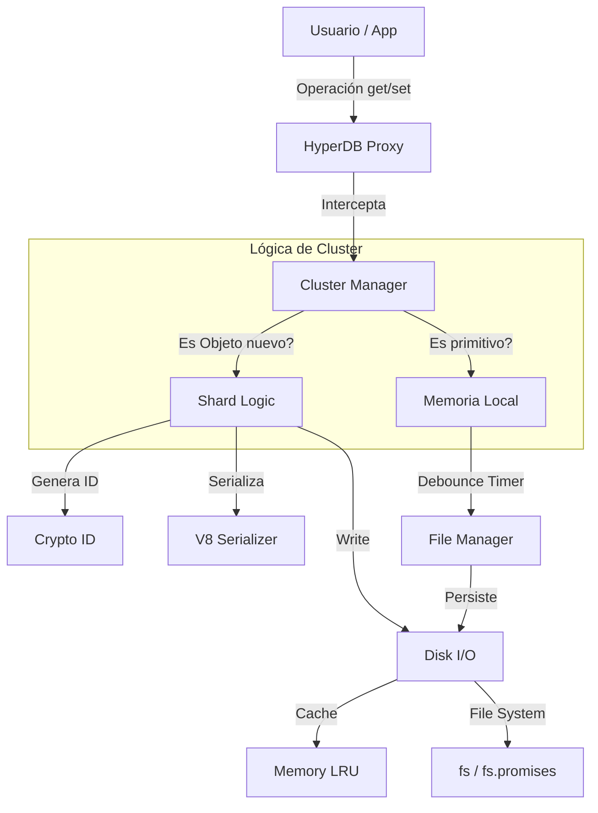
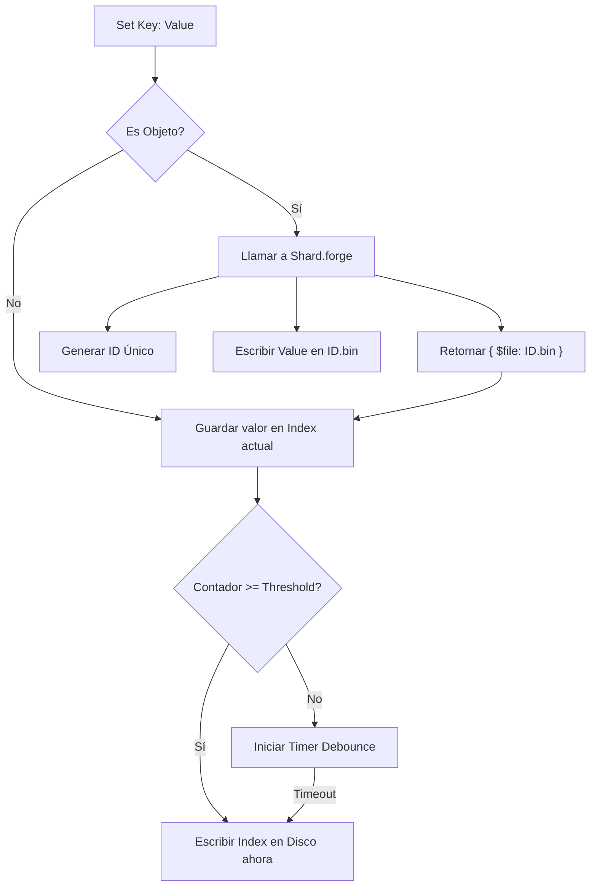

## 1. HyperDB

**HyperDB** es una base de datos binaria, fragmentada (sharded) y orientada a documentos para Node.js. Su diseño se centra en el alto rendimiento, la ausencia de dependencias externas (Zero-dependency) y una experiencia de desarrollo fluida mediante el uso de `Proxy` de JavaScript.

### ¿Para qué sirve?
Sirve para almacenar estructuras de datos complejas y profundas sin cargar todo el conjunto de datos en memoria RAM. HyperDB divide automáticamente los objetos anidados en archivos binarios separados, cargándolos bajo demanda (Lazy Loading) y gestionando la memoria mediante un sistema LRU (Least Recently Used).

### ¿A quién está dirigido?
*   Desarrolladores de **Node.js** que requieren almacenamiento persistente local rápido.
*   Proyectos que necesitan atomicidad en la escritura sin la complejidad de bases de datos SQL o NoSQL pesadas (como MongoDB).
*   Sistemas embebidos o aplicaciones de escritorio (Electron) donde minimizar las dependencias es crítico.

---

## 2. Características Principales

*   **Fragmentación Automática (Sharding):** Al guardar un objeto (`{}`) dentro de la base de datos, HyperDB lo detecta y automáticamente lo separa en su propio archivo binario (`.bin`), referenciándolo en el índice padre. Esto permite manejar bases de datos de gran tamaño sin saturar la memoria.
*   **API Transparente (Proxy):** La interacción con la base de datos es idéntica a manipular un objeto JavaScript nativo (`db.data.usuario = "x"`). No requiere métodos `get()` o `set()` explícitos para el uso básico.
*   **Serialización V8:** Utiliza el motor de serialización nativo de V8 (`v8.serialize/deserialize`), lo que lo hace significativamente más rápido y compacto que JSON.
*   **Escritura Atómica:** Garantiza la integridad de los datos escribiendo primero en archivos temporales (`.tmp`) y renombrándolos al finalizar.
*   **Gestión de Memoria (LRU Cache):** Incluye un gestor de memoria interno que descarga archivos poco utilizados cuando se supera un límite configurado (por defecto 20MB).
*   **Debouncing de Escritura:** Agrupa múltiples operaciones de escritura en un corto periodo de tiempo para reducir el I/O en disco.
*   **Zero-dependency:** No utiliza librerías de terceros, solo módulos nativos de Node.js (`fs`, `path`, `crypto`, `v8`).

---

## 3. Limitaciones Conocidas

*   **Entorno:** Exclusivo para **Node.js (>= 18.0.0)** debido al uso de `fs/promises` y sintaxis moderna.
*   **Tipos de Datos:** La fragmentación automática (creación de nuevos archivos) solo ocurre con objetos planos (`Plain Objects`). Instancias de clases personalizadas se serializan pero no generan nuevos fragmentos automáticamente a menos que se configure explícitamente.
*   **Consultas Avanzadas:** No posee un motor de consultas integrado (como SQL `WHERE` o Mongo `find`). Las búsquedas requieren recorrer el objeto o implementar índices manuales.
*   **Sincronía Aparente:** Aunque la API parece síncrona (asignación de variables), las escrituras en disco ocurren de forma asíncrona y diferida (debounced). Si el proceso de Node.js se mata abruptamente (SIGKILL) antes del *flush*, podrían perderse los últimos cambios en memoria (aunque el método `flush()` mitiga esto).

---

## 4. Instalación y Configuración

### Requisitos Previos
*   Node.js v18.0.0 o superior.

### Instalación
Dado que es un paquete local o git, se instala vía:

```bash
npm install git+https://github.com/Syllkom/HyperDB.git
# O si tienes los archivos locales:
npm install ./ruta-a-hyper-db
```

### Inicialización Básica
Para iniciar la base de datos, se debe instanciar la clase `HyperDB`.

```javascript
import { HyperDB } from 'hyper-db';

const db = new HyperDB({
    folder: './mi_base_de_datos', // Carpeta donde se guardarán los archivos
    memory: 50,                   // Límite de caché en MB
    depth: 2,                     // Profundidad de carpetas para el sharding
    index: { 
        threshold: 10,            // Operaciones antes de forzar guardado del índice
        debounce: 5000            // Tiempo de espera para guardar índice (ms)
    },
    nodes: { 
        threshold: 5,             // Operaciones antes de forzar guardado de nodos
        debounce: 3000            // Tiempo de espera para guardar nodos (ms)
    }
});
```

---

## 5. Arquitectura y Mapas

### Estructura de Archivos Generada
HyperDB organiza los datos en una estructura jerárquica para evitar saturar un solo directorio.

```text
./mi_base_de_datos/
├── index.bin          # Índice maestro (Entry point)
├── root.bin           # Datos de la raíz
└── data/              # Almacenamiento fragmentado
    ├── A1/            # Carpetas generadas por ID (según profundidad)
    │   └── B2C3.bin   # Archivo binario con datos de un sub-objeto
    └── ...
```

### Flujo de Datos (Arquitectura)



---

## 6. Ejemplos de Uso

### Caso 1: Escritura y Lectura Básica
Este ejemplo muestra cómo guardar datos simples y cómo HyperDB los persiste.

```javascript
import { HyperDB } from 'hyper-db';

const db = new HyperDB({ folder: './db' });

// 1. Asignación directa (SET)
// Esto escribe en memoria inmediatamente y programa la escritura en disco.
db.data.nombre = "HyperDB";
db.data.version = 1.0;

// 2. Lectura (GET)
console.log(db.data.nombre); // Salida: "HyperDB"
```

### Caso 2: Fragmentación Automática (Sharding)
Al asignar un objeto, HyperDB crea un archivo separado. Esto es útil para listas de usuarios o datos masivos.

```javascript
// Al asignar un objeto, se crea un nuevo archivo binario en ./db/data/...
// El índice principal solo guardará una referencia: { "configuracion": { "$file": "xx/xxxx.bin" } }
db.data.configuracion = {
    tema: "oscuro",
    notificaciones: true,
    limites: {
        diario: 100
    }
};

// Acceso transparente (Lazy Loading)
// Al acceder a .configuracion, HyperDB carga el archivo correspondiente automáticamente.
console.log(db.data.configuracion.tema); 
```

### Caso 3: Persistencia y Cierre
Cómo asegurar que los datos se guarden antes de cerrar la aplicación.

```javascript
async function cerrarApp() {
    console.log("Guardando datos...");
    
    // Fuerza la escritura de todos los procesos pendientes en el Pipe
    await db.flush(); 
    
    console.log("Datos guardados. Saliendo.");
    process.exit(0);
}
```

### Caso 4: Gestión de Ramas (Flow & Proxy)
Uso avanzado de la lógica de "Flow" para interceptar o manejar rutas específicas.

```javascript
// Obtener estadísticas de uso de memoria
console.log(db.memory()); 
// Salida: { used: "1.20 MB", limit: "20.00 MB", items: 5 }

// Eliminar una propiedad (y su archivo asociado si era un shard)
delete db.data.configuracion;
// Esto elimina la referencia y, tras el proceso de 'prune' o limpieza, el archivo físico.
```

## 7. Referencia de API Interna

Aunque la interacción principal es vía Proxy, estas clases componen el sistema:

| Clase | Descripción |
| :--- | :--- |
| **HyperDB** | Fachada principal. Configura inyecciones de dependencias y expone `this.data`. |
| **Disk** | Maneja I/O. Posee métodos `read`, `write`, `remove`. Usa colas (`Pipe`) para evitar colisiones de escritura. |
| **Memory** | Caché LRU. Evita leer del disco si el objeto ya está cargado. |
| **Shard** | Lógica de fragmentación. Decide cuándo y dónde crear nuevos archivos binarios (`forge`) y limpia referencias (`purge`). |
| **Cluster** | Coordina el índice y los datos. Intercepta las escrituras para decidir si van al archivo actual o a un nuevo shard. |
| **Flow** | Utilidad para manejar estructuras de árbol y referencias a Proxies activos. |

---

## 8. Configuración Detallada y Parámetros

El constructor de `HyperDB` acepta un objeto de opciones complejo que permite afinar el comportamiento de la base de datos, desde la ubicación de los archivos hasta la agresividad del sistema de caché y escritura.

### Estructura del Objeto `options`

```javascript
const options = {
    folder: './data',   // Ruta base del almacenamiento
    memory: 20,         // Límite de memoria en MB
    depth: 2,           // Profundidad de subcarpetas para sharding
    
    // Configuración del Índice Principal (index.bin)
    index: {
        threshold: 10,  // Operaciones antes de escritura forzada
        debounce: 5000  // Tiempo de espera (ms) para escritura diferida
    },
    
    // Configuración de Nodos/Fragmentos (archivos .bin individuales)
    nodes: {
        threshold: 5,   // Operaciones antes de escritura forzada
        debounce: 3000  // Tiempo de espera (ms) para escritura diferida
    },

    // Inyección de Dependencias (Avanzado)
    $class: {
        Disk: null,     // Clase o instancia personalizada para I/O
        Index: null,    // Clase o instancia para gestión del índice
        Flow: null,     // Clase o instancia para flujo de navegación
        Cluster: null,  // Clase o instancia para gestión de clusters
        Shard: null,    // Clase o instancia para lógica de sharding
        Memory: null    // Clase o instancia para gestión de RAM
    }
};
```

### Explicación de Parámetros

1.  **`folder`**: Define dónde se crearán los archivos. Si no existe, la clase `Disk` intentará crearla recursivamente.
2.  **`memory`**: Define el "techo suave" (soft limit) del caché LRU en Megabytes. Si los objetos cargados superan este tamaño, los menos usados se eliminan de la RAM.
3.  **`depth`**: Controla cómo se generan los IDs de los shards.
    *   `depth: 0`: Todos los archivos se guardan planos en la carpeta `data`.
    *   `depth: 2`: Se crea una estructura de carpetas basada en los primeros 2 caracteres del hash (ej. `data/A1/A1B2...bin`). Esto evita límites del sistema de archivos en directorios con miles de archivos.
4.  **`threshold` (Umbral)**: Número de operaciones de escritura (`set` / `delete`) que ocurren en memoria antes de forzar una escritura física en disco.
5.  **`debounce` (Retardo)**: Milisegundos que el sistema espera tras una escritura en memoria antes de guardar en disco si no se alcanza el umbral. *Reinicia el temporizador con cada nueva operación.*

---

## 9. Mecánica Interna de E/S (Disk & Memory)

HyperDB implementa su propio sistema de gestión de archivos y memoria para garantizar rendimiento y consistencia.

### Clase `Disk` (library/Disk.js)

Es el motor de persistencia. Sus responsabilidades clave son:

*   **Atomicidad (`write` / `writeSync`):**
    Nunca sobrescribe un archivo directamente.
    1.  Serializa los datos con `v8`.
    2.  Escribe en un archivo temporal (`filename.bin.tmp`).
    3.  Fuerza el volcado al disco físico (`fsync`).
    4.  Renombra el temporal al nombre final. Esto previene corrupción de datos si el proceso falla a mitad de escritura.

*   **Cola de Promesas (`Pipe`):**
    Para evitar condiciones de carrera en operaciones asíncronas sobre el mismo archivo, `Disk` utiliza un `Map` llamado `Pipe`.
    *   Si se solicitan 3 escrituras seguidas al mismo archivo, se encadenan en una promesa secuencial (`.then().then()`).

*   **Mantenimiento (`prune`):**
    Escanea recursivamente los directorios de datos. Si encuentra carpetas vacías (remanentes de shards eliminados), las borra para mantener el sistema de archivos limpio.

### Clase `Memory` (library/Memory.js)

Implementa un caché **LRU (Least Recently Used)** personalizado.

*   **Cálculo de Tamaño:** Usa `v8.serialize(data).length` para estimar el peso real en bytes de los objetos.
*   **Pinned Keys:** Ciertas claves críticas (como `index.bin` y `root.bin`) pueden marcarse como "pinned" para que nunca sean desalojadas del caché, garantizando que la estructura base siempre esté disponible.
*   **Eviction Policy:** Cuando `currentSize + dataSize > limit`, elimina el elemento más antiguo (`cache.keys().next().value`) hasta tener espacio.

---

## 10. Lógica de Fragmentación y Clúster

El corazón de la capacidad de escalar de HyperDB reside en la interacción entre `Cluster.js` y `Shard.js`.

### El proceso de `forge` (Forjado)
Cuando se asigna un objeto a una propiedad:

1.  **Detección:** `Cluster` detecta que el valor es un objeto plano (`Plain Object`).
2.  **Delegación:** Llama a `Shard.forge(index, value)`.
3.  **Recursividad:** `Shard` recorre el objeto. Si encuentra sub-objetos anidados que también son *shardables*, los separa recursivamente.
4.  **Generación de ID:** `Shard` genera un ID aleatorio hexadecimal (ej. `A1B2C3D4`) y calcula su ruta basada en la `depth`.
5.  **Persistencia:** Escribe el contenido del objeto en el archivo `.bin` generado.
6.  **Referencia:** Devuelve un objeto "puntero": `{ $file: "A1/A1B2C3D4.bin" }`.
7.  **Actualización del Padre:** El objeto padre guarda solo el puntero, no los datos completos.

### Diagrama de Flujo de Escritura (Cluster)



---

## 11. Sistema de Flow y Proxies

HyperDB utiliza `Proxy` de ES6 para interceptar todas las operaciones. La clase `Flow` y el mecanismo de `DB.js` gestionan la "navegación" por la base de datos.

*   **Navegación Lazy:** Cuando accedes a `db.data.usuario.perfil`, el sistema no carga `perfil` hasta que lo tocas.
*   **Apertura Dinámica:** Si el valor recuperado es un puntero `{ $file: "..." }`, el método `Proxy` en `DB.js` detecta esto, lee el archivo desde `Disk` (o `Memory`), crea un nuevo `Cluster` para ese archivo y devuelve un nuevo `Proxy` envolviendo esos datos.
*   **Flow Tree:** La clase `Flow` mantiene un árbol paralelo de referencias. Esto permite inyectar lógica personalizada o metadatos en rutas específicas del árbol de datos sin contaminar los datos almacenados.

---

## 12. Inyección de Dependencias y Extensibilidad

HyperDB permite reemplazar casi cualquiera de sus componentes internos pasando clases o instancias en el constructor. Esto es útil para testing (mocks) o para cambiar el comportamiento (ej. guardar en S3 en lugar de disco local).

### Ejemplo: Reemplazar el almacenamiento (Mocking)

Si quieres usar HyperDB puramente en memoria (sin escribir a disco) para pruebas unitarias:

```javascript
import { HyperDB, Disk } from 'hyper-db';

// Creamos un Disk personalizado o configurado solo en memoria
// Nota: La clase Disk original ya soporta esto si no se le da folder, 
// pero aquí forzamos el comportamiento mediante inyección.

class InMemoryDisk extends Disk {
    write(filename, data) {
        // Sobrescribir para no tocar 'fs'
        this.memory.set(filename, data);
        return Promise.resolve(true);
    }
    // ... implementar resto de métodos necesarios
}

const db = new HyperDB({
    $class: {
        Disk: new InMemoryDisk() 
    }
});
```

### Inyección de Funciones Compartidas
El código en `DB.js` verifica `DB.shared`. Esto permite añadir métodos globales disponibles en cualquier nivel del proxy.

```javascript
// (Internamente en una versión modificada de HyperDB)
this.shared = {
    hola: function() { console.log("Hola desde", this.index.$file); }
}

// Uso:
// db.data.users.hola() -> Imprime el archivo donde viven los usuarios
```

---

## 13. Mantenimiento y Manejo de Errores

### Manejo de Errores (`onError`)
La clase `Disk` acepta un callback `onError`. Por defecto, imprime a `console.error`.

```javascript
const db = new HyperDB({
    $class: {
        Disk: new Disk({
            onError: (err) => {
                // Enviar a sistema de logs (Sentry, Datadog, etc.)
                alertAdmin("Error crítico de IO en DB", err);
            }
        })
    }
});
```

### Limpieza de Archivos (`Prune`)
Con el tiempo, al borrar objetos, pueden quedar carpetas vacías en la estructura de shards. El método `prune` las elimina.

```javascript
// Se recomienda ejecutar esto en tareas cron o al inicio/cierre
await db.disk.prune();
```

### Recuperación de Fallos
Si la aplicación se cierra inesperadamente (`SIGKILL`), los archivos `.tmp` pueden quedar en la carpeta de datos.
*   **Al inicio:** HyperDB no limpia automáticamente los `.tmp`.
*   **Integridad:** Dado que la operación de renombrado (`fs.rename`) es atómica en sistemas POSIX, el archivo `.bin` original estará intacto o será la nueva versión completa. No hay estados intermedios de archivo corrupto.

---

## Resumen de Archivos Fuente

*   **`package.json`**: Metadatos y scripts (sin tests definidos).
*   **`Disk.js`**: Capa física. `fs`, `v8`, `Pipe`, `Memory`.
*   **`Memory.js`**: Capa lógica de caché. LRU, cálculo de tamaño.
*   **`Shard.js`**: Lógica de particionado. Generación de IDs, purga recursiva.
*   **`Flow.js`**: Utilidad de estructura de árbol para metadatos de navegación.
*   **`DB.js`**: Entry point. Gestión de Proxies e Inyección de Dependencias.
*   **`Cluster.js`**: Gestión de nodos. `Index`, `File` (debounce/threshold), `Cluster` (lógica get/set).
*   **`index.js`**: Exportador de módulos.

Aquí tienes la tercera y última parte de la documentación técnica de **HyperDB**. Esta sección cubre **Seguridad**, **Optimización de Rendimiento**, **Solución de Problemas** y una **Referencia Rápida de API**.

---

## 14. Consideraciones de Seguridad

Dado que HyperDB opera directamente sobre el sistema de archivos local y utiliza serialización binaria, existen vectores de seguridad específicos que deben considerarse.

### 1. Deserialización de Datos (`v8.deserialize`)
HyperDB utiliza el motor nativo de V8 para serializar/deserializar datos.
*   **Riesgo:** La deserialización de datos no confiables puede llevar a la ejecución de código arbitrario o comportamientos inestables si el archivo binario ha sido manipulado externamente.
*   **Mitigación:** Asegúrese de que la carpeta de datos (`./data` por defecto) tenga permisos de escritura **exclusivos** para el usuario del sistema que ejecuta el proceso Node.js. Nunca apunte HyperDB a una carpeta donde usuarios externos puedan subir archivos.

### 2. Permisos de Archivos (File System)
HyperDB necesita permisos de lectura y escritura (`fs.read`, `fs.write`, `fs.mkdir`, `fs.rm`).
*   **Requisito:** El proceso Node.js debe tener control total sobre el directorio raíz definido en `options.folder`.
*   **Error Común:** Ejecutar la aplicación como `root` y luego como `user` puede causar errores de `EACCES` si los archivos fueron creados por `root`.

### 3. Inyección de Dependencias
La característica de inyección (`$class`) permite reemplazar componentes internos.
*   **Precaución:** Si su aplicación permite configuración externa que se pasa directamente al constructor de `HyperDB`, un atacante podría inyectar clases maliciosas. Valide siempre el objeto `options` antes de pasarlo al constructor.

---

## 15. Guía de Rendimiento y Buenas Prácticas

Para obtener el máximo rendimiento (High-Performance) prometido por HyperDB, siga estas directrices:

### Estrategia de Sharding (Fragmentación)
El sharding automático es potente, pero tiene un costo de I/O (crear archivo, abrir handle, escribir).

*   **Cuándo usarlo:** Para objetos grandes o listas que crecen indefinidamente (ej. `db.data.usuarios`, `db.data.logs`).
*   **Cuándo evitarlo:** Para objetos pequeños o de configuración (ej. `{ x: 1, y: 2 }`). Si un objeto tiene pocas propiedades primitivas, es mejor dejarlo dentro del archivo padre (`Index`) en lugar de aislarlo en un nuevo archivo.
*   **Consejo:** HyperDB decide hacer shard si asignas un `Plain Object`. Si asignas primitivos (`string`, `number`), se quedan en el archivo actual.

### Ajuste de Memoria (`Memory Limit`)
*   **Escenario:** Servidor con mucha RAM.
    *   **Acción:** Aumente `options.memory`. Por defecto es 20MB. Subirlo a 100MB o 500MB reducirá drásticamente las lecturas a disco, ya que más shards permanecerán "calientes" en RAM.
*   **Escenario:** Entorno Serverless (AWS Lambda) o contenedores pequeños.
    *   **Acción:** Mantenga el límite bajo (10-20MB) y reduzca `options.index.debounce` a valores cercanos a 0 o 100ms para asegurar que los datos se escriban antes de que la función se congele.

### Uso de `flush()`
Las operaciones de escritura son asíncronas y diferidas ("debounced").
*   **Mejor Práctica:** Siempre llame a `await db.flush()` antes de finalizar el proceso o en puntos críticos de la lógica de negocio donde la persistencia inmediata es obligatoria.

---

## 16. Solución de Problemas Frecuentes

### Problema: "Los cambios no se guardan al reiniciar"
*   **Causa:** La aplicación se detuvo forzosamente (Crash o `SIGKILL`) antes de que el temporizador de *debounce* (por defecto 3-5 segundos) se disparara.
*   **Solución:** Reduzca los tiempos de `debounce` en la configuración o asegúrese de capturar eventos de cierre (`process.on('SIGINT', ...)`) y llamar a `db.flush()`.

### Problema: "Error: Invalid options"
*   **Causa:** Se pasó `null`, `undefined` o un tipo no objeto al constructor.
*   **Verificación:** Asegúrese de instanciar con `{}` como mínimo: `new HyperDB({})`.

### Problema: Consumo excesivo de inodos en disco
*   **Causa:** `depth: 0` con miles de objetos crea miles de archivos en una sola carpeta.
*   **Solución:** Use `depth: 2` o superior en la configuración. Esto distribuye los archivos en subcarpetas (ej. `A1/B2/...`), lo cual es más amigable para sistemas de archivos como EXT4 o NTFS.

### Problema: "Object exceeds cache limit"
*   **Síntoma:** Advertencia en consola `[HyperDB:Memory] Object '...' exceeds cache limit`.
*   **Causa:** Está intentando guardar un solo objeto (un solo shard) que es más grande que el límite total de memoria asignado a la DB.
*   **Solución:** Aumente `options.memory` o divida ese objeto gigante en sub-objetos más pequeños para que HyperDB pueda fragmentarlo.

---

## 17. Referencia Rápida de API Pública

Resumen de los métodos y propiedades expuestos para el desarrollador.

### Constructor
```javascript
const db = new HyperDB(options);
```
Ver sección de configuración para detalles de `options`.

### Propiedades
*   **`db.data`**: (Proxy) El punto de entrada principal para leer y escribir datos. Se comporta como un objeto JS estándar.
*   **`db.disk`**: (Instancia de `Disk`) Acceso directo a operaciones de archivo (bajo nivel).
*   **`db.index`**: (Instancia de `Index`) Acceso al gestor del archivo índice raíz.

### Métodos
*   **`db.open(...path)`**: 
    *   *Descripción:* Abre manualmente una ruta específica y devuelve un Proxy para ese nodo.
    *   *Uso:* `const userConfig = db.open('users', 'id_123', 'config');`
*   **`db.flush()`**: 
    *   *Descripción:* Fuerza la escritura de todas las operaciones pendientes en la cola (`Pipe`) y espera a que terminen.
    *   *Retorno:* `Promise<true>`
*   **`db.memory()`**: 
    *   *Descripción:* Devuelve estadísticas del uso de memoria actual.
    *   *Retorno:* `{ used: string, limit: string, items: number }`
*   **`delete db.data.propiedad`**: 
    *   *Descripción:* Elimina la clave y, eventualmente, purga el archivo asociado del disco.

### Métodos Internos (Accesibles vía `db.disk`)
*   **`db.disk.prune()`**: 
    *   *Async.* Escanea y elimina carpetas vacías en el directorio de datos.

---

## 18. Comparativa Técnica

Para entender dónde encaja HyperDB:

| Característica | HyperDB | JSON (fs.writeFile) | SQLite | MongoDB |
| :--- | :--- | :--- | :--- | :--- |
| **Formato** | Binario (V8) Fragmentado | Texto Plano (Monolítico) | Binario (Relacional) | Binario (BSON) |
| **Carga en RAM** | **Lazy (Solo lo necesario)** | Todo el archivo | Paginada | Paginada |
| **Escritura** | Atómica y Parcial | Reescribe todo el archivo | Transaccional (SQL) | Documento |
| **Dependencias** | **Cero (Nativo)** | Cero | `sqlite3` (binding C++) | Driver + Servidor |
| **Consultas** | Traversal (JS nativo) | Array methods | SQL | Query Language |
| **Uso Ideal** | Config, Estado local, Grafos de objetos | Config simple | Datos tabulares | Big Data / Cloud |

**Conclusión:** HyperDB es ideal cuando JSON se queda corto por rendimiento/memoria, pero SQLite es excesivo o demasiado rígido (schemas) para la estructura de datos dinámica que maneja la aplicación.

---